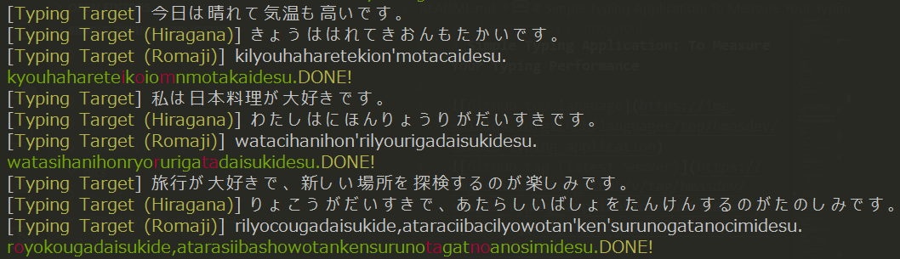

# Simple Typing Application: To Measure Your Typing Performance




## Requires


- Python >= 3.8

  - `click`
  - `langchain`
  - `openai`
  - `pydantic`
  - `pynput`
  - `requests`
  - `types-pynput`
  - `types-requests`

- OpenAI API Key

See `pyproject.toml` for detail information.

## Installation

You can install `simple_typing_application` with `pip`.

```bash
pip install git+https://github.com/hmasdev/simple_typing_application.git
```

If you want to install the full-version, i.e. `simple_typing_application` with data analysis packages like `pandas`, `matplotlib` and `jupyterlab`, specify `[extra]`.

```bash
$ git clone https://github.com/hmasdev/simple_typing_application.git
$ cd simple_typing_application
$ pip install .[extra]
```

You can specify the following optional dependencies:

- `[huggingface]`
- `[extra]`
- `[dev]`

For more details, see [`./pyproject.toml`](./pyproject.toml).

## Usage

### Configuration

You can specify some parameters with '.json'.

For example, the following `.json` files are valid:

- [`./sample_config.json`](./sample_config.json)
- [`./sample_config_huggingface.json`](./sample_config_huggingface.json)
- [`./sample_config_static.json`](./sample_config_static.json)

The content of `./sample_config.json` is as follows:

```json
{
    "sentence_generator_type": "OPENAI",
    "sentence_generator_config": {
        "model": "gpt-3.5-turbo-16k",
        "temperature": 0.7,
        "openai_api_key": "HERE_IS_YOUR_API_KEY",
        "memory_size": 0,
        "max_retry": 5
    },
    "user_interface_type": "CONSOLE",
    "user_interface_config": {},
    "key_monitor_type": "PYNPUT",
    "key_monitor_config": {},
    "record_direc": "./record"
}
```

As default, the contents of 'sample_config.json' are used except `openai_api_key`.
In this case, you should add an environment variable `OPENAI_API_KEY` which contains your API key.

#### Sentence Generator

You can specify the followings as `sentence_generator_type`:

- `OPENAI`: Use OpenAI API to generate typing targets;
- `HUGGINGFACE`: Use the model available in HuggingFace to generate typing targets;
- `STATIC`: Use typing targets which you have specified.

For each `sentence_generator_type`, you can specify the detailed parameters as `sentence_generator_config`:

- `OPENAI`
  - `model`: See [langchain.chat_models.openai.ChatOpenAI](#langchain.chat_models.openai.ChatOpenAI)
  - `temperature`: See [langchain.chat_models.openai.ChatOpenAI](#langchain.chat_models.openai.ChatOpenAI)
  - `openai_api_key`: See [langchain.chat_models.openai.ChatOpenAI](#langchain.chat_models.openai.ChatOpenAI)
  - `memory_size`: See [langchain.memory.buffer.ConversationBufferMemory](#langchain.memory.buffer.ConversationBufferMemory)
  - `max_retry`: Maximum number of times to rerun when an error occurs

- `HUGGINGFACE`
  - `model`: Model name. For example, "line-corporation/japanese-large-lm-3.6b", "rinna/japanese-gpt-neox-3.6b", "rinna/bilingual-gpt-neox-4b" and "cyberagent/open-calm-7b" are available as Japanese LLM. For details, See [huggingface.co/models](#huggingface_models_available_text_generation).
  - `do_sample`: `true` or `false`. See [huggingface.co/docs/transformers/pipeline_tutorial](#huggingface_pipeline_tutorial).
  - `max_length`: int. See [huggingface.co/docs/transformers/pipeline_tutorial](#huggingface_pipeline_tutorial).
  - `top_k`: int. See [huggingface.co/docs/transformers/pipeline_tutorial](#huggingface_pipeline_tutorial).
  - `top_p`: float between 0 and 1. See [huggingface.co/docs/transformers/pipeline_tutorial](#huggingface_pipeline_tutorial).
  - `device`: `cpu` or `cuda`

- `STATIC`
  - `text_kana_map`: key-value pairs whose keys are row typing targets and values are typing targets which do not include kanjis;
  - `is_random`: whether typing targets are randomly selected or sequentially displayed.

To see the default values, see [`./simple_typing_application/models/config_models/sentence_generator_config_model.py`](./simple_typing_application/models/config_models/sentence_generator_config_model.py).

#### User Interface

You can specify the followings as `user_interface_type`:

- `CONSOLE`: CUI

For each `user_interface_type`, you can specify the detailed parameters as `user_interface_config`:

- `CONSOLE`
  - No parameters

To see the default values, see [`./simple_typing_application/models/config_models/user_interface_config_model.py`](./simple_typing_application/models/config_models/user_interface_config_model.py).

#### Key Monitor

You can specity the followings as `key_monitor_type`:

- `PYNPUT`: `pynput`-based local key monitor
- `SSHKEYBOARD`: `sshkeyboard`-based key monitor

For each `key_monitor_type`, you can specify the detailed parameters as `key_monitor_config`:

- `PYNPUT`
  - No parameters
- `SSHKEYBOARD`
  - No parameters

To see the default values, see [`./simple_typing_application/models/config_models/key_monitor_config_model.py`](./simple_typing_application/models/config_models/key_monitor_config_model.py).

### Launch the application

You can launch this application with the following command:

```bash
python -m simple_typing_application -c HERE_IS_YOUR_CONFIG_FILE
```

If you want to launch this application with debug mode, run the following command:

```bash
python -m simple_typing_application -c HERE_IS_YOUR_CONFIG_FILE --debug
```

For more details, run `python -m simple_typing_application --help`.

### Do typing

`simple_typing_application` shows typing targets through the interface which you has specified.
Type correct keys.
Note that `Typing Target (Romaji)` displayed in your interface is one of correct typing patterns. For example, when `Typing Target (Hiragana)` is 'ち', both 'ti' and 'chi' are correct although only one of them is displayed.

In addition to normal typing, the following keys can be accepted:

- `Esc`: to quit the application;
- `Ctrl+c`: to quit the application;
- `Tab`: to skip the current typing target.

### Analyze Your Typing Performance

The application records your typing in the following format in the directory specified in you config file for each typing target.

```json
{
    "timestamp": "HERE IS TIMESTAMP THE TYPING START WITH FORMAT %Y-%m-%dT%H:%M:%S.%f",
    "typing_target": {
        "text": "HERE IS TYPING TARGET",
        "text_hiragana_alphabet_symbol": "HERE IS TRANSFORMED STRING WHICH CONTAINS ONLY HIRAGANA, ALPHABET AND SYMBOLS",
        "typing_target": [["CORRECT PATTERN. TYPICALLY ROMANIZED STRING", ...], ...]
    },
    "records": [
        {
            "timestamp": "HERE IS TIMESTAMP WHEN YOU TYPE %Y-%m-%dT%H:%M:%S.%f",
            "pressed_key": "WHICH KEY YOU HAVE PRESSED",
            "correct_keys": ["", ...],
            "is_correct": true or false
        },
        ...
    ]
}
```

Refer to [`./sample_record.json`](./sample_record.json) for example.

## Development

1. Fork this repository:
   - [https://github.com/hmasdev/simple_typing_application/fork](https://github.com/hmasdev/simple_typing_application/fork)

2. Clone your forked repository:

   ```bash
   $ git clone https://github.com/hmasdev/simple_typing_application
   $ cd simple_typing_application
   ```

3. Create your feature branch:

   ```bash
   $ git checkout -b feature/your-feature
   ```

4. Setup your development environment:

   ```bash
   $ pip install .[dev]
   ```

   if you want to develop the application with `huggingface`, `pandas` and etc., run the following command:

   ```bash
   $ pip install .[huggingface,extra,dev]
   ```

   To know which option is available, see [`./pyproject.toml`](./pyproject.toml).

5. Develop your feature and add tests.

6. Test your feature:

   ```bash
   $ pytest  # Unit test
   $ pytest -m integrate  # integration test
   ```

7. Check the code style and static type:

   ```bash
   $ flake8 simple_typing_application
   $ flake8 tests
   $ mypy simple_typing_application
   $ mypy tests
   ```

8. Commit your changes:

   ```bash
   $ git add .
   $ git commit -m "Add your feature"
   ```

9. Push to the branch:

   ```bash
   $ git push -u origin feature/your-feature
   ```

10. Create a new Pull Request:
    - [https://github.com/hmasdev/simple_typing_application/compare](https://github.com/hmasdev/simple_typing_application/compare)

Thank you for your contribution!

## LICENSE

`simple_typing_application` is licensed under the [MIT](./LICENSE) License. See the LICENSE file for more details.

## References

- [1] <a id="langchain.chat_models.openai.ChatOpenAI"></a> https://api.python.langchain.com/en/latest/chat_models/langchain.chat_models.openai.ChatOpenAI.html
- [2] <a id="langchain.memory.buffer.ConversationBufferMemory"></a> https://api.python.langchain.com/en/latest/memory/langchain.memory.buffer.ConversationBufferMemory.html
- [3] <a id="huggingface_models_available_text_generation"></a> https://huggingface.co/models?pipeline_tag=text-generation
- [4] <a id="huggingface_pipeline_tutorial"></a> https://huggingface.co/docs/transformers/pipeline_tutorial

## Authors

- [hmasdev](https://github.com/hmasdev)
